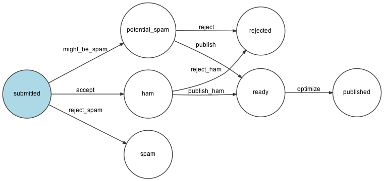

# Guestbook

A project following the book [Symfony 5: The Fast Track](https://symfony.com/book) write by Fabien Potencier

## Symfony local server
Start server 
``
make start
``

Stop server 
``
make stop
``

Run test 
``
make tests
``

Open in browser 
``
symfony open:local
``

## Entity Workflow

Generate workflow ([Graphviz](https://www.graphviz.org/) required)  
``
symfony console workflow:dump 'entity' | dot -Tpng -o workflow.png
``

Comment workflow 

## Other information

* Commit messages based on [Gitmoji](https://gitmoji.carloscuesta.me/)